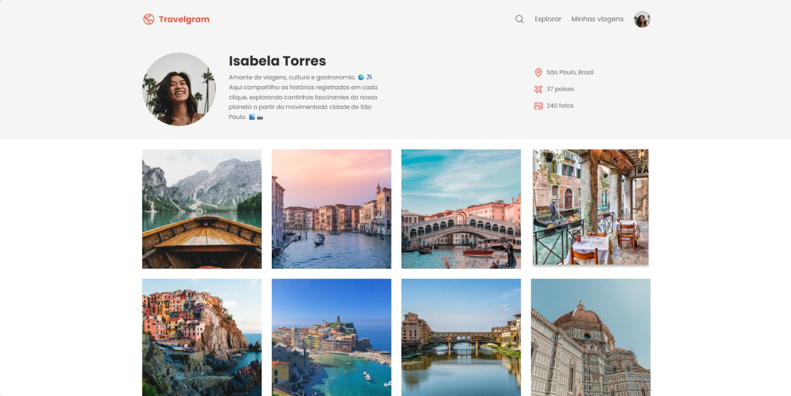
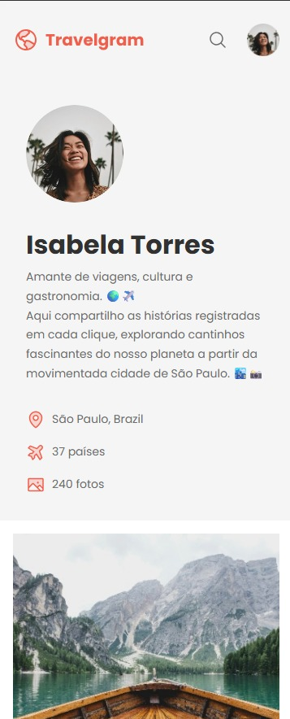

# Travelgram | Perfil de Viagens

Projeto desenvolvido junto com a Rocketseat, inspirado em perfis de viagens para compartilhar experiências e fotos de lugares incríveis pelo mundo.

---

## Tela principal

Aqui está a tela principal do projeto:

## 📖 Sobre o projeto

Este projeto consiste em um perfil de viagens com layout responsivo, utilizando HTML e CSS puros, focado em uma experiência visual agradável tanto em desktop quanto em dispositivos móveis.

---

## 🛠 Tecnologias usadas

- HTML5
- CSS3
- Google Fonts (Alice e Poppins)

---

## 📱 Responsividade

O layout é responsivo, adaptando-se para telas de celulares, tablets e desktops, usando media queries e técnicas modernas de CSS.

---

## 📄 Licença

Este projeto está sob a licença MIT.

---

## 👨‍💻 Autor

- Lucas Moura — [https://github.com/keewonf](https://github.com/keewonf)

---

## 🎨 Design

Design feito no Figma pela Rocketseat Community — [Link do Figma](https://www.figma.com/design/c98wR4fQL7DtqxsJLj6rTL/Perfil-de-viagens--Community-?node-id=3-376&p=f&t=xstGrLlCoXGhGSbZ-0)
